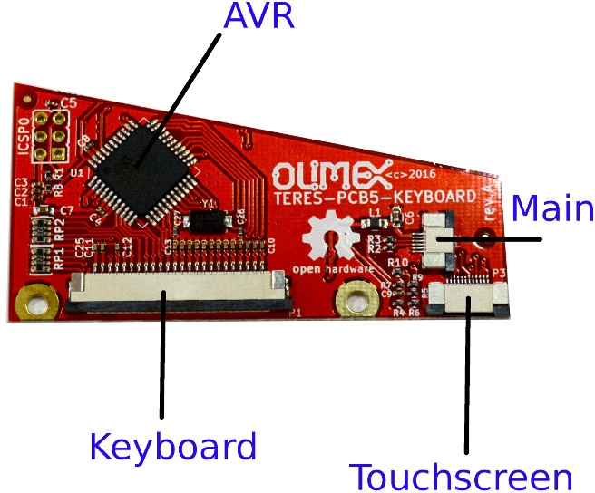

# Hardware

## Overview

All hardware schematics and board files are designed using [KiCad](http://kicad-pcb.org) open-source CAD software.

> KiCad is free software. KiCad is made available under the [GNU General Public License (GPL) version 3](https://www.gnu.org/licenses/gpl-3.0.en.html) or greater.

You may download KiCad and open for reviewing or editing each of the PCB files.
The schematics are also available as PDF files for easier viewing and/or printing.

**NOTE**: Please use the latest KiCad nightly development build, as the latest stable build may not have all required features.

## Introduction to the hardware of TERES-I

TERES-I internal electronics consists of the folowing boards:

### Main board ([PCB1-A64-MAIN](A64-TERES/TERES-PCB1-A64-MAIN))

The main board (**PCB1-A64-MAIN**) is comprised of:

* A64 processor
* RAM and flash NAND memories
* Power management unit
* LCD converter
* Connectors to different interfaces
* and others

Alternative main board processors and memory configuration options will be available in the future.
These should be compatible with all other existing boards.
Subsequent revisions are expected to have increased processing speed and improved memory performance.

### Keyboard controller ([TERES-PCB5-KEYBOARD](A64-TERES/TERES-PCB5-KEYBOARD))

The **KEYBOARD controller** board (**TERES-PCB5-KEYBOARD**) is responsible for handling the keyboard and touch pad interfaces.
This keyboard controller board allows you to completely reprogram the keyboard mapping and response according to your own taste.

This board contains an AVR processor.
Sources, binaries and update procedures for AVR firmware are available at GitHub.
Keyboard/touch controller firmware may be updated live on the board itself.
It can also be programmed using an Arduino microcontroller.
Touch screen parameters can also be changed.

### I/O board ([TERES-PCB2-IO](A64-TERES/TERES-PCB2-IO))

The **IO** board (**TERES-PCB2-IO**) is comprised of:

- USB connector
- Headphone/debug connector
- SD card
- Speaker connector
- Microphone

### Power button ([TERES-PCB4-PWR-BTN](A64-TERES/TERES-PCB4-PWR-BTN))

The **PWR** button board (**TERES-PCB4-PWR-BTN**) handles the keys for powering on and off the laptop.

### Touch buttons ([TERES-PCB3-TOUCH-BTN](A64-TERES/TERES-PCB3-TOUCH-BTN))

The **TOUCH** buttons board (**TERES-PCB3-TOUCH-BTN**) contains two buttons for left and right mouse click emulation.

### Camera ([TERES-019-Camera](A64-TERES/TERES-019-Camera))

