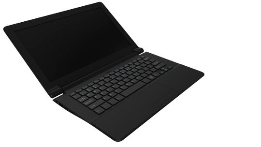

 

# TERES-I Laptop

  

## Overview

TERES-I is a Do-It-Yourself (DIY) Free/Open Source Hardware ([FOSH](https://wikipedia.org/wiki/Open-source_hardware)) and Software ([FOSS](https://wikipedia.org/wiki/Free_and_open-source_software)) laptop design.
It runs Linux on 64-bit ARM64 and x86 processors.
TERES-I is currently considered an [evaluation board](doc/web/evaluation-board-notice.md) and not yet an end-product.

TERES-I has a stylish and elegant shape and an 11.6” LCD screen.
It is also a very light product.
Weighing less than one kilogram, it is convenient to carry when traveling.
TERES-I is great for playing videos, browsing the web, or using a plethora of development suites.

DIY kits are ready-to-assemble using the [instructions provided](doc/web/hw_assembly.md) and may be purchased [here](https://www.olimex.com/Products/DIY-Laptop/KITS).

## [Hardware](HARDWARE)

* [TERES-A64-WHITE](https://www.olimex.com/Products/DIY-Laptop/KITS/TERES-A64-WHITE)
* [TERES-A64-BLACK](https://www.olimex.com/Products/DIY-Laptop/KITS/TERES-A64-BLACK)
* [Spare parts](https://www.olimex.com/Products/DIY-Laptop/SPARE-PARTS)
* [Assembling your TERES-I](doc/web/hw_assembly.md)

## [Software](SOFTWARE)

TERES-I was designed to run on Linux distributions, but may also run Android and Windows operating systems.
The laptop's mainboard has eMMC flash loaded with Ubuntu Mate and basic programs – Internet browser, Open Office, Arduino IDE, IceStorm FPGA Verilog tools, a video player, etc.
Additional software is also available from Ubuntu repositories.

* [Installing an image](doc/web/sw_fresh-os.md)
* [Updating an image](doc/web/sw_updating-os.md)
* Building an image
  * [Internal script](SOFTWARE/A64-TERES/scripts/README.md)
  * [Manual build reference](http://linux-sunxi.org/Manual_build_howto)

## Other resources

* [FAQ](doc/web/res_faq.md)
* [Troubleshooting](doc/web/res_troubleshooting.md)
* [Download manuals](doc/manuals)
* [What's next?](doc/web/res_next-steps.md)
* [Community Links](doc/web/res_community.md)
