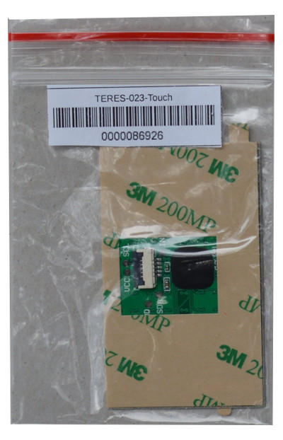
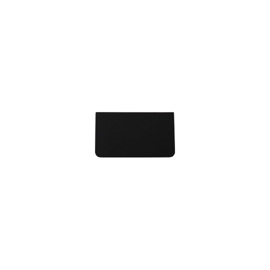
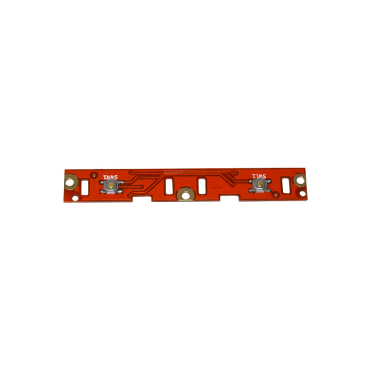
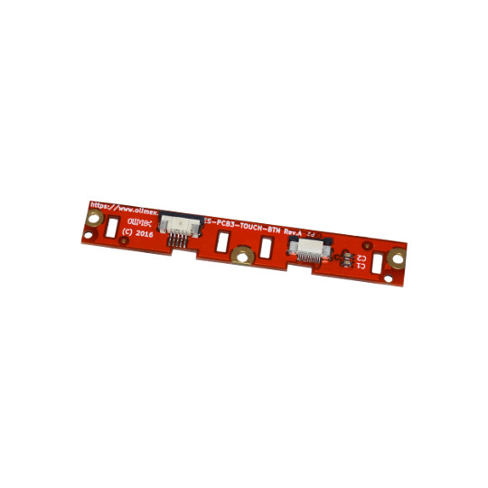
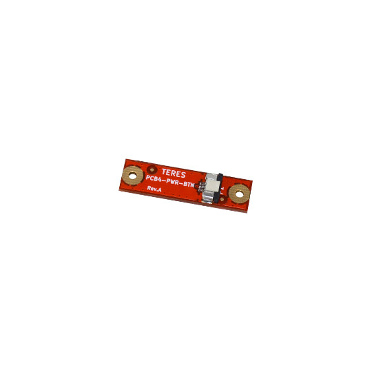
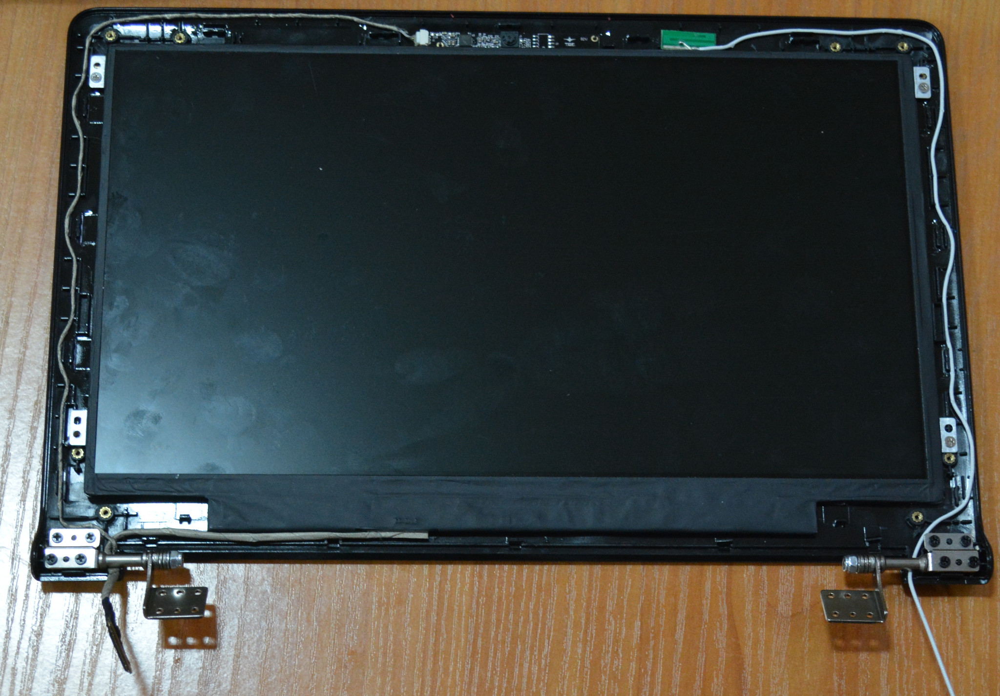

# How do I assemble my TERES-I?

Prepare your workplace before starting the assembly process – make sufficient room and cover your desk with a soft textile to prevent scratching the laptop's plastic parts.
Do not rush during the assembly.
Make sure to read and follow the instructions carefully since disassembling the finished unit to fix mistakes is considerably harder than assembling it.

[What's included?](hw_in-the-box.md)

The assembly process begins with the **TERES-006-Keyboard**:

 

First attach the touchpad **TERES-023-Touch** to the keyboard's body:

 

The touchpad uses double sided adhesive tape.
Remove the protective foil and place it on the top side of the keyboard body like shown in the pictures below:

 

You must be careful about the orientation of the touchpad connector.
The exposed pins of the connector must be pointing UP.

The touchpad snaps very tight to the upper side plastic.
You should place it with on an even surface and make sure it is fully inserted.

Next, turn over the cover and place **TERES-022-Touch-Cover** and **TERES-010-Touch-Btns** on top of the touchpad:

 

The final result must look like these pictures:

 

The next step is to attach the TERES printed circuit boards to the keyboard body.
For this purpose use the **TERES-014-Screw-Set**.
Note that in this set there are 42 screws of different lengths:

* M2 x 1.5 ( 4 pcs)
* M2 x 3   ( 9 pcs)
* M2 x 4   (17 pcs)
* M2 x 5   (12 pcs)

It is a good practice to first sort all the screws since each screw has its own location and you should put the exact length screw to the exact place as mentioned.
All screws have same diameter M2 but different lengths – if you have difficulties determining the size, use a ruler.
For example, the M2 x 5 screw would have 5mm length (without the head).
Do not mix the lengths of the screws since doing so might damage the plastic parts.
Do not screw as tight as possible, since this might break the plastic.
Be gentle.

For the PCB’s the M2 x 3 screws must be used.

Now we assemble the **TERES-PCB3-Touch** PCB:

 

It is shown below, attached to the keyboard body.
Note that only the middle screw is used; the other two screws will later be used when fixing the bottom plastic cover:

The next PCB to attach is the **TERES-PCB2-IO**:

 

The PCB2 board has a microphone which has to be placed in the side pocket specially designated for it.

After the microphone is put in place, slip the board at an angle into the side openings for the SD card, USB, and audio connector, then place it down.

Then use one M2 x 3 screw to fix the board:

Please make sure that the side connectors are well aligned:

Next you put the PWR button plastic:

 

Then the LED pipe:

 

Next attach the TERES-PCB4-Btn (the power button):

 

The TERES-PCB4-Btn is attached with two screws M2 x 3 mm, connector pointing to the right side:

The next step is to assemble the big **TERES-PCB1-A64**:

 

This is the main board and you should handle it very carefully.
Do not bend it, do not drop it, etc.
This board is very sensitive to static electricity.

It’s a bit tricky to put it in the correct position as you have to slide it right so the connectors enter properly in the side openings.
If you succeed you will see all the PCB support nuts from the keyboard body pass exactly through the openings of the PCB.
You need to use just two M2 x 3 screws to attach it:

Again, make sure that he side connectors are properly aligned:

Now connect **TERES-PCB2-IO** with **TERES-PCB1-A64**.
For this purpose, use the Flat Cable **TERES-027-FPC-IO-Main**. 

There are two 40-pin connectors on **TERES-PCB2-IO** and **TERES-PCB1-A64**.
You have to open the latch – pull the dark plastic of the connector up and insert the FPC cable above it with the contacts up:

After you have inserted the cable, push the dark plastic back down so it locks the cable to the connector:

Repeat the same with the **TERES-PCB1-A64**.
**TERES-PCB2-IO** and **TERES-PCB1-A64** are now connected together:

Do the same for **TERES-PCB4-Btn** and **TERES-PCB1-A64**.
Use the small flat cable **TERES-028-FPC-Pwr-Main**.
These connectors are similar to the previous ones.
You should again disengage the lock (pull the dark plastic up), then insert the flat cable with the contacts pointing UP between the white and dark plastic then push the dark plastic back.
Here is the flat cable connected to both connectors:

The next step is to connect the touch panel **TERES-023-Touch** to the board with touch buttons **TERES-PCB3-TOUCH**.
Use the flat cable **TERES-029-FPC-Touch-Btn**.
Note that these connectors are different; the touch panel connector has a hinge and the dark plastic gets opened upside as on this picture:

The flat cable is also inserted with the contacts pointing down and blue back up:

The connector on **TERES-PCB3-TOUCH** is also different so the cable is inserted below the dark plastic again with blue back pointing up:

You have to bend the cable twice.
Do not bend at a very sharp angle and don't bend it too hard, else it might break!

The next step is to attach the **TERES-PCB5-KEYBOARD** to the keyboard flat cable as shown on the picture below.
Note that the cable goes under the black sliding plastic of the connector:

Do not assemble the keyboard PCB to the plastic base yet.

The next step is to connect **TERES-PCB5-KEYBOARD** with **TERES-PCB3-TOUCH**.
Use **TERES-031-FPC-Kbd-Btn** flat cable for this purpose.
The cable is inserted with contacts up above the black plastic of the connector, the same as the power button and main board cables:

Next connect **TERES-PCB5-KEYBOARD** with **TERES-PCB1-A64** and using one M2 x 3 screw attach **TERES-PCB5-KEYBOARD** to the plastic body.
Note that only the left screw is placed.
The right screw will come when attaching the bottom plastic.

The final assembly step is to attach the left and right speakers.
Look at the bottom side you will notice that Right speaker is assembled at the left hand side, and Left speaker – at the right hand side.

For this purpose use M2 x 4 screws and only the upper one is screwed.
The speaker connectors should be inserted in **TERES-PCB2-IO** and **TERES-PCB1-A64** boards.

Now continue with LCD frame assembly using the **TERES-008-LCD-Back** as base:

First attach the metal hinges to the **TERES-016-Hinge-Set** using 8 pcs M2 x 4 screws:

Next attach **TERES-026-LCD-cable** to the **TERES-015-LCD** 11.6" panel ([datasheet](../datasheets/TERES-015-LCD11.6/N116BGE-EA2.pdf)):

With M2 x 1.5 screws assemble the LCD to the plastic.
Note that only 4 screws are used!

  

Connect the **TERES-019-Camera** to the four pin connector of the **TERES-026-LCD-cable**.
There are two holes in the camera board which attach to two pins on the plastic body.

On the other side attach **TERES-025-WiFi-Antenna** with double-sided adhesive tape to the plastic body:

Follow the wiring shown on the picture below for the correct path of the LCD and WiFi cables.
Pay attention on how the cables go around the plastic locks and hinges!
It is incredibly important to keep EXACTLY the same layout else the cover will NOT snap properly later.

The LCD cable wiring is probably most difficult part of the whole assembly.
If you do not do it correctly the LCD frame above it will not snap tight.

The **018-Magnet** is placed in special place on the left hand of the LCD:

Now place the panel.
If you did the wiring correctly, the panel will snap tightly.
You will have something like this:

If the panel doesn't snap properly and you have to remove the cover to re-do the wiring, please, be patient else the plastic locks can break.
You can use a credit card or other similar card as a lever to separate the bottom and top parts of the display.

Then fix the upper corners with M2x3 mm screws like this:

Now place the **TERES-020-Camera-Lens** above the camera sensor and rubber mats over the two screws:

Now assemble the LCD part with the keyboard body.
Use 6 screws M2 x 4 mm for this purpose:

Note that there are four places on the hinges but only three get assembled with screws.
The fourth hole should be left empty; the extra screw will come from the bottom plastic body attachment.
The places where you have to put screws are stamped at the metal hinges with arrows.

Next connect the WiFi antenna cable and LCD cable to **TERES-PCB1-A64**:

The next step is to attach four double adhesive mats that would hold the LiPo battery in place:

Attach the battery and plug the battery connector to the PCB1.
Mind the orientation of the cable and polarity!
Red cables should go to the left side.

Next put the **TERES-021-Dust-Protectors** at the openings of the bottom plastic **TERES-005-Bottom**:

In the next image, you see the dust covers placed over the two openings:

Next assemble the bottom plastic using 12 of M2 x 5 screws:

The final step is to attach the rubber mats to the four locations at the bottom:

The assembly is now complete.
Now press the PWR button and the laptop will boot:

Congratulations! You assembled your own laptop TERES-I!
