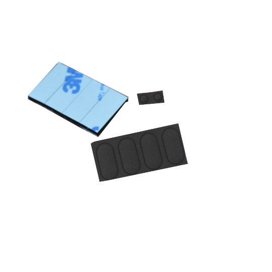
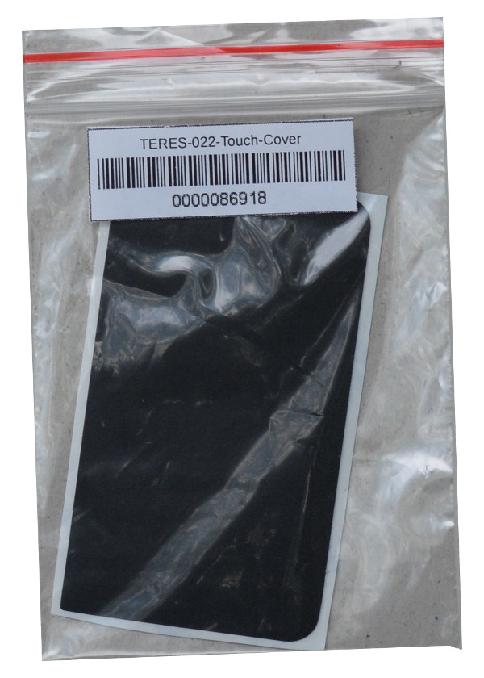

# What do you get in the package?

With your DIY kit, you will receive:

Description                          | Images
:-----------------------------------:|:-----------------------------------:
| PCB1 (PCB1-A64-MAIN) – main PCB with A64 processor, 2GB RAM, 16GB eMMC. It is in an ESD protective bag. Please handle with proper anti-static precautions | 
| PCB2 (TERES-PCB2-IO) – IO PCB with microphone, connectors for: speaker, USB, SD-card, headphones | 
| PCB3 (TERES-PCB3-TOUCH-BTN) – TOUCH two button PCB | 
| PCB4 – PWR PCB (PCB4-PWR-BTN) with button for power on/off | 
| PCB5 (TERES-PCB5-KEYBOARD) – KEYBOARD PCB with controller of the keyboard and touchpad | 
| Bottom body plastic part, packed in bubble wrap to protect from scratches |  
| Keyboard body plastic assembly |  
| LCD plastic frame |  
| LCD back plastic body |  
| Plastic power button |  
| Plastic touch buttons |  
| Left speaker |  
| Right speaker |  
| Transparent LED pipe |  
| Set of screws: M2x1.5 mm – 4 pcs; M2x3 mm – 9 pcs; M2x4 mm – 17 pcs; M2x5 mm – 12 pcs |  
| [eDP](https://www.embedded.com/design/system-integration/4441940/eDP--A-better-embedded-display-ecosystem) 11.6" HD (1366x768) LCD. It has protective foil on top. [Datasheet](../datasheets/TERES-015-LCD11.6/N116BGE-EA2.pdf) |  
| Left and right hinges |  
| Mat set. There are four rubber pads for the bottom of the laptop, two circular pads for LCD frame screws cover and four self adhesive mats for holding the battery. |  
| Magnet for the lid close sensor |  
| Camera [[Datasheet](../../../HARDWARE/A64-TERES/TERES-019-Camera/N03A61B36DL32.pdf)] |  
| Camera lens |  
| Two dust protectors – big and small |  
| Touchpad cover |   
| Touchpad | 
| LiPo battery 9500 mAh [[Datasheet](../../datasheets/LiPo-Battery/JA426992P2P-Spec-Data-Sheet-3.7V-7000mAh--161201.pdf)] | 
| WiFi/Bluetooth antenna |  
| LCD/camera cable |  
| Flat cable Main-IO |  
| Flat cable Power-Main, Flat cable Main-Keyboard |  
| Flat cable Touchpad-TouchButtons |  
| Flat cable Keyboard-TouchButtons |  
| Power adapter EU Style 5V 3A with 3 meter cable and LED status GREEN/RED indicator with UK and US plug adapters |   
