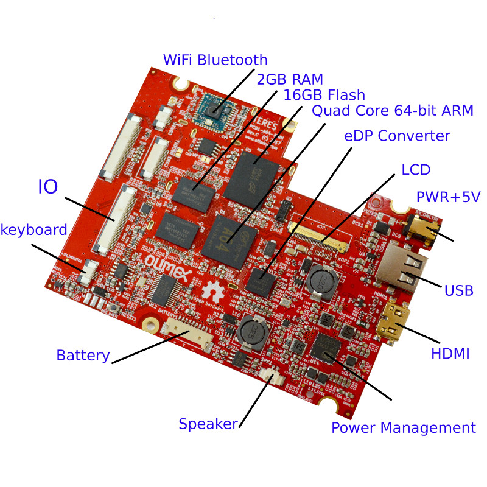

# Introduction to the hardware of TERES-I

The TERES-I electronics part consists of five boards.
Each board was designed with [KiCad](http://kicad-pcb.org/) open source CAD software.
You may download KiCad* and open for reviewing or editing each of the PCB files.
The schematics are also available as PDF exports for easier viewing.

**NOTE**: Make sure to download the latest KiCad nightly development build.
The latest stable build may not have the features required.

The MAIN board (PCB1-A64-MAIN) contains:

* A64 processor
* RAM and flash NAND memories
* Power management unit
* LCD converter
* Connectors to different interfaces
* and others

It looks like this:

We expect to release extra main boards with different processors and memory configurations in the future.
These should work with all other existing boards.
It is expected newer main boards to have higher laptop speed and improved memory performance.

The KEYBOARD controller board (TERES-PCB5-KEYBOARD) has an AVR processor.
You can update the firmware of the keyboard/touch controller live on the board itself.
It can also be programmed via an Arduino microcontroller.
This board is responsible for handling the keyboard and touch pad interfaces.

Sources, binaries and update procedures for the AVR firmware are available at GitHub.
This keyboard controller board allows you to completely reprogram the keyboard mapping and response according to your own taste.
The touch screen parameters can also be changed.

The **IO** board (**TERES-PCB2-IO**) contains the USB connector, headphone/debug connector, SD card, speaker connector and microphone.

The **PWR** button board (**PCB4-PWR-BTN**) handles the keys for powering on and off the laptop.

The **TOUCH** buttons board (**TERES-PCB3-TOUCH-BTN**) contains two buttons for left and right mouse click emulation.

