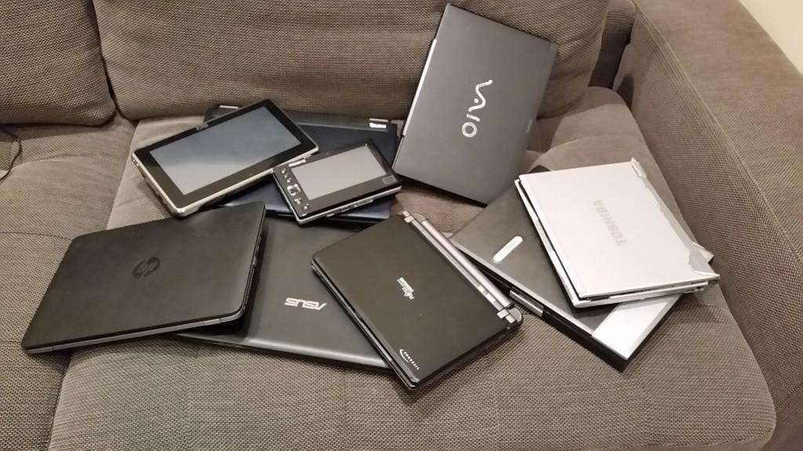

# Why create an open-source, modular laptop?

- Laptop break or become obsolete every few years, as new software requires more processing power or memory
- Batteries lose their capacity over time or stop charging at all
- We sometimes drop them, and replacement parts can often be expensive and difficult to find
- Sometimes I spill things on the keyboard, or some keys just wear out over time with normal use
- Power jacks wear out and proper charging becomes unreliable or impossible

Some parts on your vehicle are difficult to repair/replace, not because they necessarily have to be, but because manufacturers would prefer that you have the vehicle repaired at a dealership.
Unfortunately, many computer vendors work the same way!
Laptops are often **designed** to be difficult to fix so that you will simply purchase a new laptop.

**This must stop.**

# Why does open-source matter so much?

Proprietary, closed-source products:

- do not come with source code
- provide no access to the board's design layout
- do not allow users to easily add the functionality that they want
- do not allow users to modify what they don't like
- generally make it difficult (or impossible) to repair your own product

On the other hand, open-source projects provide:

## Transparency

Most complex hardware projects are closed-source (i.e. a black box) and you may only indirectly infer how components are connected or how things generally operate.
Open-source products provide transparency and the freedom to know as much as possible about the products you and others enjoy.
You are able to review and modify open-source software.
You have full access to both the hardware and the software components and you are able to control every bit of your laptop.
You don't even have to purchase anything to access these resources; you can use our work (or parts of it) as a basis for existing projects.

## Freedom To Modify

Open-source hardware allows you and others to tailor the PCBs according to user needs.
For example, you are able to add more processors, memories, etc.

It also gives you independence and self-sufficiency.
If a problem arises (any problem!), you have the freedom to fix it.

This repository provides the hardware design files and schematics for the TERES-I laptop.
The hardware design is made with an open-source CAD tool called KiCad.

## Peace Of Mind

There is no scary, hidden text or legal "fine print" for you to worry about.
No lawyers will chase after you for using this material, either for personal or commercial use.
Consult the [license](../../LICENSE) for further information.

## Ease Of Use

The sources for the Linux distribution and step-by-step compilation instructions are available and easily accessible.
Documentation can behave as living documents - aggregated reference materials to solve a veriety of uncertainties.

## Education

There is great educational value of open-source products inherent in the availability of materials to study.
You will likely learn many new things during assembly of this laptop.
You can build it together along with children or students, sparking interest in electronics and technology in general.
You will have the freedom to learn about every aspect of this computer system and will have the resources available to fix it if something doesn't suit your needs or gets damaged.

## Support

You don't have to solely rely on availability of technical support.
If you don't like the way something works, have an idea for an improvement, or think the documentation sucks, you have the freedom to improve it yourself or ask others for help!

## Longevity

Open source guarantees longevity.
Contributors may fork the project, make improvements, and merge those improvements back into the main project to benefit everyone.
There is no concern that a company goes bankrupt and the products disappear.
If a particular component (i.e. an integrated circuit or capacitor, etc) becomes obsolete or unavailable, the general public has the freedom to replace it within the design files with a more modern or common component.

# Sanity check

How open it will be?
Everyone has his own definition for openness.

- One may want open source GPU drivers
- One may need electrolyte capacitors fluid formula
- One may want to know how transistors are photo-imaged onto the silicon wafer

We can't please everyone!

The more things are open the better, but if a particular component, transistor, resistor, or capacitor may be purchased in relatively low quantities, it will work.
If you can learn, study, and reproduce the design using commonly-sourced components, it is considered "open source" to us.
If the schematics, CAD files, Linux build scripts, etc, are available, this will be sufficient for someone to construct their own laptop.
