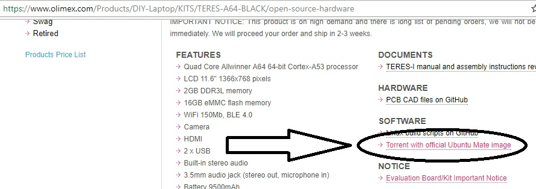
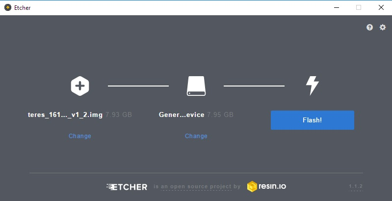

# Installing a fresh image onto TERES-I internal memory (eMMC)

## Materials

- TERES-I (optional: another host computer if the TERES-I is inoperable)
- SD card writer (TERES-I has a [micro SD](glossary.md) port on the right side of the unit)
- Micro SD card (8GB or larger)
- Stable internet connection to download the image torrent file
- An hour or two to perform the process

## Introduction

You may sometimes wish to update Linux on the [eMMC memory](glossary.md).
This may be if the eMMC got corrupted, the original installation got damaged, or if there are no other means to update to the latest software releases, etc).

## Procedure

1. Download and extract the latest image provided by Olimex.
A download link for the torrent with the latest image is available at the **SOFTWARE** section of the product's page, found at the following links:

- [White TERES-I](https://www.olimex.com/Products/DIY-Laptop/KITS/TERES-A64-WHITE/open-source-hardware)
- [Black TERES-I](https://www.olimex.com/Products/DIY-Laptop/KITS/TERES-A64-BLACK/open-source-hardware)

The download link looks like this:



2. Remember to extract the image from the archive.

```bash
unzip <filename.zip>
```
3. Insert a micro SD card into the port of the **host computer**.
There is a micro SD port on the right side of the TERES-I.
Alternatively, use an SD card port on a computer of your choice; you may require an adapter for your situation.

4. Write the ``.img`` file to the micro SD card.

First, determine the path of the inserted micro SD card using the ``lsblk`` command.
It begins with ``/dev`` and ends with something like ``sdb``.
The name may not always be consistent, so **please be careful**!

It is now time to write the image file you downloaded onto the micro SD card.
The ``dd`` command works great for this task.
For the following example, everything between ``<>`` needs to be modified to fit your situation:

```bash
sudo dd if=</path/to/image-to-load.img> of=/dev/<micro-sd-device-name> bs=1M status=progress
```

To describe what is happening:

- ``if``: input file (the image file you downloaded)
- ``of``: output file (the micro sd device you inserted)
- ``bs``: block size (the size of each "chunk" of data to write to the output device)
- ``status=progress``: display the status of the operation

If you are not comfortable with this procedure, graphical tools are available such as [Etcher](https://etcher.io).
Etcher is compatible with Linux, Windows, and MacOS, and you may download the installer for your host operating system and start the software.

To use Etcher:
Select the image that you extracted.
Then point to the drive of the micro SD card.
It looks like this:



5. Insert the micro SD card into your TERES-I and power on the laptop using the power button.
The TERES-I will boot from the micro SD card.

6. Log in to the TERES-I.
You will be asked for a username and password in a command line.

- Username: ``olimex``
- Password: ``olimex``

7. Once you log in to the TERES-I, execute the eMMC installer script.
This script copies the contents of the micro SD card to the built-in eMMC memory inside your TERES-I.
To run the script, type:

```bash
sudo install_emmc.sh
```

You will be asked for confirmation and then you would be prompted to select the eMMC drive.
Select the defaults and wait until the install script completes.
This script may take up to 15 minutes to complete.

8. Remove the micro SD card from the TERES-I.
This allows the TERES-I to boot from the freshly-loaded image in its eMMC memory.

9. Power on the TERES-I and verify that it booted successfully.

**Congratulations - task complete!**
